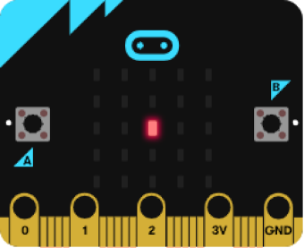
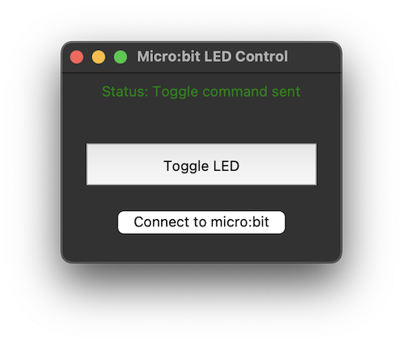

# Micro:bit LED Control Project Tutorial

> **Disclaimer**: This tutorial was generated with the assistance of AI (specifically Cursor AI). While every effort has been made to ensure accuracy and completeness, please verify all information and code before implementation. The tutorial is provided "as is" without any warranties.

This tutorial covers a complete project for controlling a micro:bit's LED display from a PC using Python. The project includes both GUI and command-line interfaces, as well as the micro:bit code.




## Table of Contents
1. [Project Overview](#project-overview)
2. [Virtual Environment Setup](#virtual-environment-setup)
3. [Requirements](#requirements)
4. [Project Structure](#project-structure)
5. [Micro:bit Code](#microbit-code)
6. [PC Applications](#pc-applications)
   - [GUI Version](#gui-version)
   - [CLI Version](#cli-version)
7. [Usage Guide](#usage-guide)
8. [Troubleshooting](#troubleshooting)

## Project Overview

This project consists of three main components:
1. A micro:bit program that controls the LED display
2. A GUI application for PC control
3. A command-line application for PC control

The PC applications can:
- Connect to the micro:bit via serial communication
- Toggle the center LED on the micro:bit
- Show connection status and feedback

## Requirements

### Hardware
- micro:bit board
- USB cable
- Computer with USB port

### Software
- Python 3.x
- Required Python packages (see Virtual Environment)

## Virtual Environment Setup

It's recommended to use a virtual environment to manage project dependencies. Here's how to set it up:

### Creating a Virtual Environment

1. Create a new virtual environment:
   ```bash
   # On Windows
   python -m venv .venv

   # On macOS/Linux
   python3 -m venv .venv
   ```

2. Activate the virtual environment:
   ```bash
   # On Windows
   .venv\Scripts\activate

   # On macOS/Linux
   source .venv/bin/activate
   ```

3. Install required packages in the virtual environment:
   ```bash
   pip install pyserial uflash
   ```

### Managing the Virtual Environment

- To deactivate the virtual environment when you're done:
  ```bash
  deactivate
  ```

- To see installed packages:
  ```bash
  pip list
  ```

- To create a requirements file:
  ```bash
  pip freeze > requirements.txt
  ```

- To install from a requirements file:
  ```bash
  pip install -r requirements.txt
  ```

### Virtual Environment Best Practices

1. Always activate the virtual environment before working on the project
2. Keep the virtual environment in the project directory
3. Add `.venv/` to your `.gitignore` file
4. Share the `requirements.txt` file with others
5. Update requirements when adding new dependencies

## Project Structure

```
microbit-led-control/
├── microbit_led_toggle.py    # micro:bit code
├── pc_led_control.py         # GUI version
├── pc_led_control_cli.py     # CLI version
└── TUTORIAL.md              # This tutorial
```

## Micro:bit Code

The micro:bit code (`microbit_led_toggle.py`) is a simple program that:
- Listens for serial input
- Toggles the center LED when it receives '1'
- Shows an error pattern if something goes wrong

```python
from microbit import *

# Initialize the display
display.clear()

# Set initial LED state
led_state = False

while True:
    if uart.any():  # Check if there's any data to read
        try:
            # Read the incoming data
            data = uart.readline().decode('utf-8').strip()

            # Toggle the LED state if we receive '1'
            if data == '1':
                led_state = not led_state
                # Update the display
                display.set_pixel(2, 2, 9 if led_state else 0)

        except Exception as e:
            # If there's an error, show an X pattern
            display.show(Image.NO)
            sleep(1000)
            display.clear()
```

### Flashing the Micro:bit Code

1. Connect your micro:bit to your computer
2. Run the following command:
   ```bash
   uflash microbit_led_toggle.py
   ```
3. Wait for the yellow LED on the back to stop flashing

## PC Applications

### GUI Version

The GUI version (`pc_led_control.py`) provides a graphical interface with:
- A large toggle button
- Connection status display
- Connect/Reconnect button

Key features:
- Automatic micro:bit detection
- Visual feedback for all actions
- Error handling with user-friendly messages

### CLI Version

The command-line version (`pc_led_control_cli.py`) provides a text-based interface with:
- Simple keyboard commands
- Clear status messages
- Help system

Available commands:
- `t` - Toggle LED
- `c` - Connect to micro:bit
- `h` - Show help
- `q` - Quit

## Usage Guide

### Setting Up

1. Install required packages:
   ```bash
   pip install pyserial uflash
   ```

2. Flash the micro:bit:
   ```bash
   uflash microbit_led_toggle.py
   ```

   if everythin works you should see this output on your CLI:
   ```bash
   (.venv) (base) your_user@your_computer microbit-led-control % uflash microbit_led_toggle.py
   Flashing microbit_led_toggle.py to: /Volumes/MICROBIT/micropython.hex
   ```

3. Connect the micro:bit to your computer

### Using the GUI Version

### Using the CLI Version

1. Run the CLI application:
   ```bash
   python pc_led_control_cli.py
   ```

2. Use the commands:
   - Type `t` and press Enter to toggle the LED
   - Type `c` to reconnect if needed
   - Type `h` to see all commands
   - Type `q` to quit

1. Run the GUI application:
   ```bash
   python pc_led_control_gui.py
   ```

2. The application will automatically try to connect to the micro:bit

3. Use the interface:
   - Click "Toggle LED" to toggle the center LED
   - Click "Connect to micro:bit" if connection is lost
   - Watch the status label for feedback


## Troubleshooting

### Common Issues

1. **No micro:bit found**
   - Check USB connection
   - Try a different USB cable
   - Restart the application

2. **Connection failed**
   - Make sure no other program is using the serial port
   - Try reconnecting using the connect button/command
   - Restart both the micro:bit and the application

3. **LED not responding**
   - Check if the micro:bit code is properly flashed
   - Try reflashing the micro:bit
   - Check the status messages for errors

### Debug Tips

1. Watch the status messages in both applications
2. Check the micro:bit's display for error patterns
3. Try reconnecting if the connection is lost
4. Make sure the micro:bit is properly powered

## Extending the Project

Possible extensions:
1. Add more LED control options
2. Create patterns or animations
3. Add button input from the micro:bit
4. Implement two-way communication
5. Add configuration options

## Contributing

Feel free to:
- Report issues
- Suggest improvements
- Submit pull requests
- Share your modifications

## License

This project is open source and available under the MIT License.
